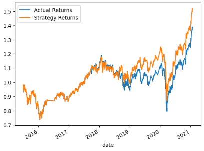

# Machine Learning Trading Bot: Evaluation Report
## Introduction
This portion of the notebook takes historical OHLCV stock data from 2015-2021, split it into training and testing datasets, then run the testing datasets through two different machine learning models: SVC Classifier Model and AdaBoost Classifier Model. The purpose of this challenge is to test which model performs better in comparison to the actual returns.

## Baseline Results
The original data was split into training and testing sets and fit into the SVC classifier model. These are the results from this model:

### SVC Model Classification Report

### SVC Model vs. Actual Returns Plot

The same original data was also fit into the AdaBoost classifier model. These are the results:

### AdaBoost Model Classification Report

### AdaBoost Model vs. Actual Returns Plot

Comparing these two models it is evident that the SVC model provides a higher recall score compared to that of the AdaBoost model recall score. Both models provide a similar precision score. By examining both graphs the strategy returns from the SVC model outperform the actual returns from 2019 onwards, whereas the strategy returns from the AdaBoost model underperform the actual returns from 2019 to 2020.

## Backtested Results
In a seperate Jupyter Lab Notebook (ref. machine_learning_trading_bot_backtest.ipynb), the parameters of the original data was altered to change the training and testing sets and once again fit into the same models. The purpose of this backtest is to evaluate whether the model becomes more accurate with these changes or not. To do this, the short window and long window SMA values were changed to 8 and 75 respectively. Another parameter that was changed was the DateOffset value, which is now set to 6 months for this backtest. These are the results from this model:

### SVC Model Classification Report

### SVC Model vs. Actual Returns Plot

The same backtested data was also fit into the AdaBoost classifier model. These are the results:

### AdaBoost Model Classification Report

### AdaBoost Model vs. Actual Returns Plot

By comparing the the classification reports of both models, it is clear that the adjusted parameters has changed the results. The recall score for the SVC model has improved and the precision score has also improved slightly. However for the AdaBoost model, the precision and recall scores suffered with the adjusted parameters. This is evident in the graphs as well. The SVC model strategy returns perform on par with the actual returns and slightly outperforms the actual returns from 2020 onwards. However the opposite is true for the AdaBoost model. The strategy returns on that graph are significantly worse than the actual returns and move in opposite directions for the most part.